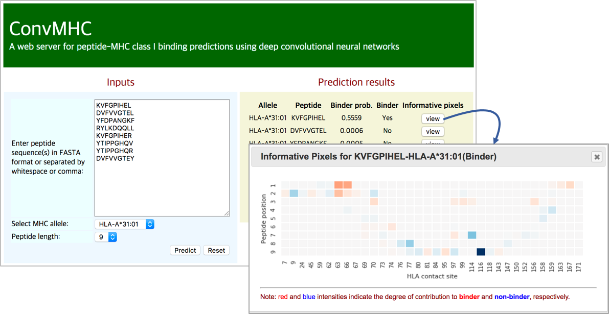

# ConvMHC
<b>A web server for peptide-MHC class I binding predictions using Deep Convolutional Neural Networks(DCNNs)</b>
## Screenshot

<p>
The main web interface of ConvMHC consists of the input form panel (left) and the result list panel (right).
Users can submit multiple peptide sequences and a HLA-I allele in the input form panel.
Once the prediction process is completed, the user can see the prediction results of the input peptides in the result list panel.
For each prediction result, the user can also identify the informative pixels captured by the DCNN on the transformed peptide binding image through a pop-up panel.
</p>

## Installation
- Requirements when you setup ConvMHC server:
    - Python 2.7.3
    - Flask 1.0+
    - Theano 0.8.2
    - Keras 1.1.2
    - deeplift-0.4.0-alpha
- ConvMHC requires DeepLIFT(https://github.com/kundajelab/deeplift) to identify informative pixels on a peptide-MHC binding image. 
Current source directory includes the DeepLIFT package(deeplift-0.4.0-alpha.tgz). You can install the package as follows:
```commandline
tar xvfz deeplift-0.4.0-alpha.tgz
pip install deeplift
```
## Run ConvMHC web server
Just run _src/main.py_ as follows:
```commandline
cd src
python main.py
```
Once ConvMHC web server is started, the main web interface is accessible via http://localhost:5000

<hr>

## Citation
<a href="https://bmcbioinformatics.biomedcentral.com/articles/10.1186/s12859-017-1997-x">Han, Y. & Kim, D. (2017). Deep convolutional neural networks for pan-specific peptide-MHC class I binding prediction. BMC bioinformatics, 18, 1-9.</a>
